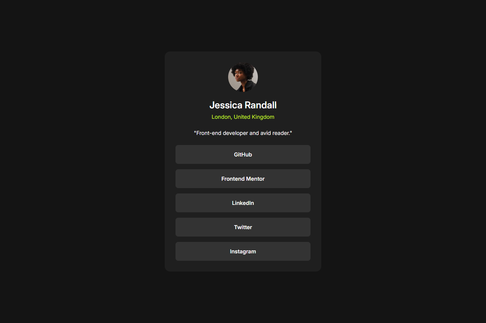

# Frontend Mentor - Social links profile solution

This is a solution to the [Social links profile challenge on Frontend Mentor](https://www.frontendmentor.io/challenges/social-links-profile-UG32l9m6dQ). Frontend Mentor challenges help you improve your coding skills by building realistic projects.

## Table of contents

- [Overview](#overview)
  - [The challenge](#the-challenge)
  - [Screenshot](#screenshot)
  - [Links](#links)
- [My process](#my-process)
  - [Built with](#built-with)
  - [What I learned](#what-i-learned)
  - [Continued development](#continued-development)
  - [Useful resources](#useful-resources)
- [Author](#author)
- [Acknowledgments](#acknowledgments)

## Overview

### The challenge

Users should be able to:

- See hover state for all interactive elements on the page

### Screenshot



### Links

- Solution URL: [solution URL here](https://github.com/Saran-Sandeep/FEM-Social-Links-Profile)
- Live Site URL: [live site URL ](https://fem-social-links-profile-vert.vercel.app/)

## My process

### Built with

- Semantic HTML5 markup
- CSS custom properties
- Flexbox
- CSS Grid
- Mobile-first workflow

### What I learned

During this project, I improved my skills in:

1. **Using CSS custom properties for consistent theming:**

```css
:root {
  --green: hsl(75, 94%, 57%);
  --white: hsl(0, 0%, 100%);
  --grey-700: hsl(0, 0%, 20%);
  --grey-800: hsl(0, 0%, 12%);
  --grey-900: hsl(0, 0%, 8%);
}
```

2. **Implementing responsive design using media queries:**

```css
@media (min-width: 375px) {
  .container {
    max-width: 375px;
  }
}

@media (min-width: 1440px) {
  .container {
    max-width: 480px;
  }
}
```

3. **Creating smooth hover effects with transitions:**

```css
.social-links-card__link {
  transition: background-color 0.3s;
}

.social-links-card__link:hover {
  background-color: var(--green);
}
```

4. **Flexbox for centering and layout:**

```css
body {
  display: flex;
  justify-content: center;
  align-items: center;
  height: 100vh;
  height: 100svh;
}
```

### Continued development

In future projects, I want to focus on:

1. Improving accessibility features
2. Implementing more advanced CSS animations
3. Exploring CSS Grid for complex layouts
4. Enhancing responsive design techniques

### Useful resources

- [MDN Web Docs](https://developer.mozilla.org/en-US/docs/Web/CSS) - Comprehensive resource for CSS properties and techniques.
- [CSS-Tricks](https://css-tricks.com/) - Great articles on modern CSS techniques and best practices.

## Author

- Website - [Yedla Saran Sandeep](https://personal-portfolio-mocha-psi-53.vercel.app/)
- Frontend Mentor - [@Saran-Sandeep](https://www.frontendmentor.io/profile/Saran-Sandeep)
- GitHub - [@Saran-Sandeep](https://github.com/Saran-Sandeep)

## Acknowledgments

I'd like to thank the Frontend Mentor community for providing feedback on my previous projects, which helped me improve this solution. Special thanks to the challenge creators for providing such an engaging project to work on.
